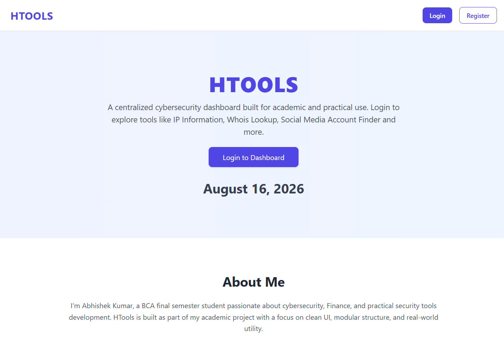
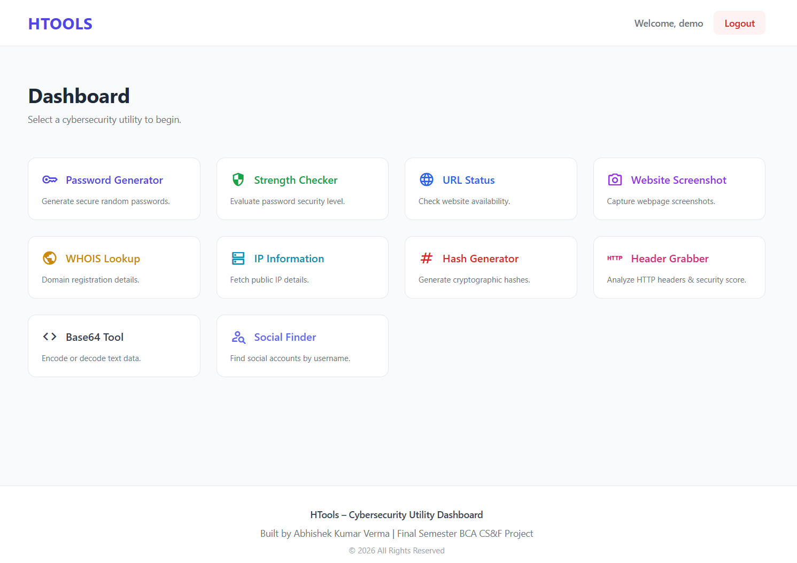
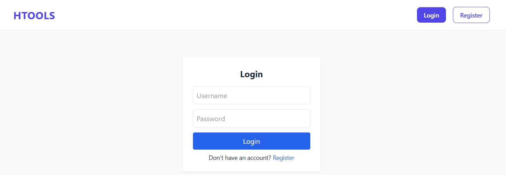
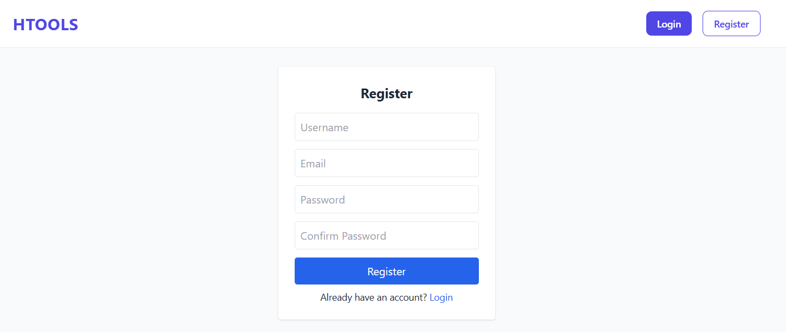
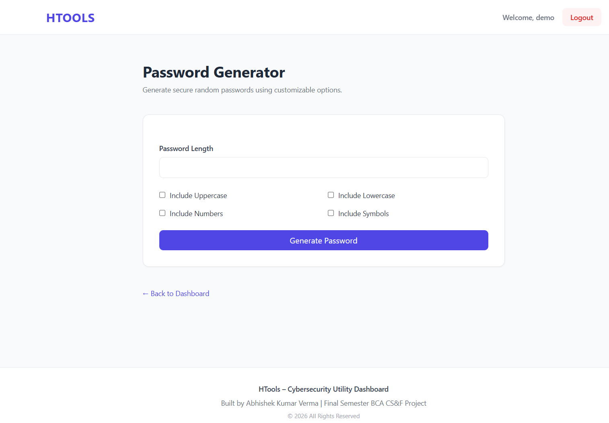
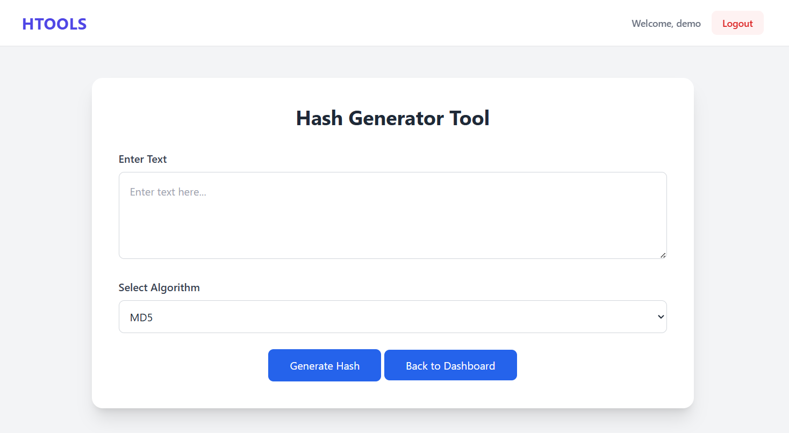
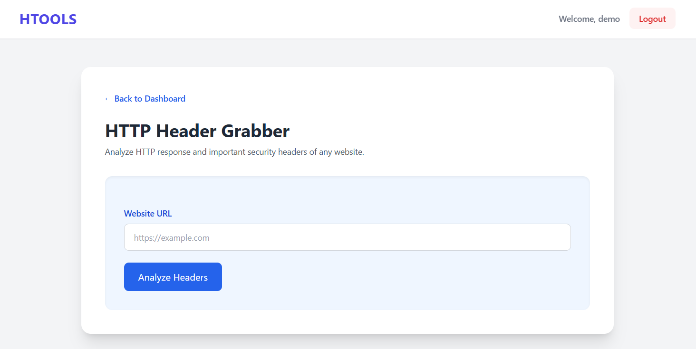
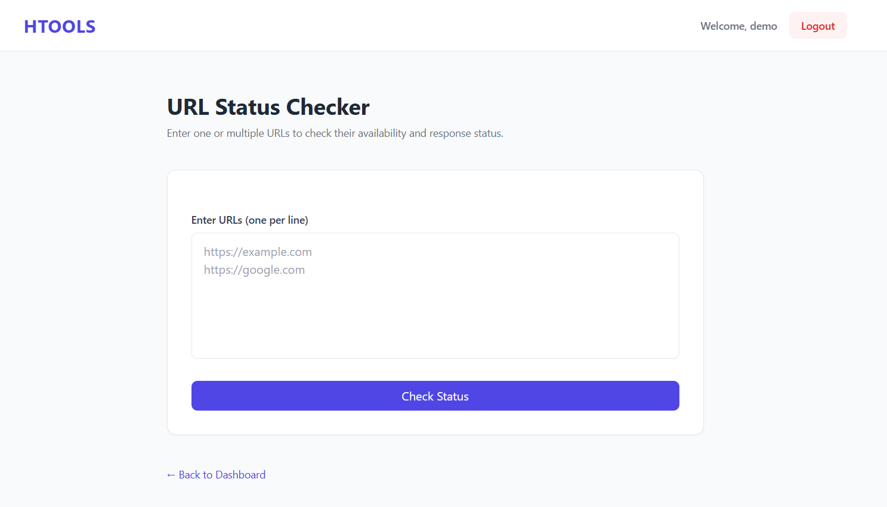

# 🛠️ HTools

<p align="center">
  <b>A Multi-Purpose Web Toolkit</b>
  <br><br>
  Built with Python • Django • HTML • Tailwind CSS • SQLite
</p>

---

## 📌 About HTools

**HTools** is a web-based toolkit developed as a **college project** using **Python, Django, HTML, Tailwind CSS, and SQLite**.

The main purpose of HTools is to bring multiple useful tools into a single web application. The project follows a modular Django structure where different functionalities are separated into individual Django applications.

HTools provides tools related to passwords, hashing, encoding, URLs, HTTP headers, IP information, WHOIS, screenshots, and other utilities.

---

## ✨ Features

HTools includes the following tools and modules:

* 🔐 **Password Generator**
* 💪 **Password Strength Checker**
* #️⃣ **Hash Generator**
* 🔢 **Base64 Tool**
* 🌐 **IP Information**
* 📡 **HTTP Header Grabber**
* 🔗 **URL Status Checker**
* 📸 **Web Screenshot**
* 🌍 **WHOIS Checker**
* 🔎 **Social Finder**
* 👤 **User Accounts**
* 🏠 **Home & Dashboard**

---

## 🧰 Tech Stack

| Technology          | Purpose                                   |
| ------------------- | ----------------------------------------- |
| 🐍 **Python**       | Application programming and backend logic |
| 🎯 **Django**       | Web application framework                 |
| 🌐 **HTML**         | Web page structure                        |
| 🎨 **Tailwind CSS** | User interface and styling                |
| 🗄️ **SQLite**      | Database                                  |

---

# 📸 Screenshots

## 🏠 Home & Dashboard

<table>
<tr>
<td width="50%">

<p align="center"><b>Home Page</b></p>
</td>
<td width="50%">

<p align="center"><b>Dashboard</b></p>
</td>
</tr>
</table>

---

## 👤 Authentication

<table>
<tr>
<td width="50%">

<p align="center"><b>Login</b></p>
</td>
<td width="50%">

<p align="center"><b>Register</b></p>
</td>
</tr>
</table>

---

## 🔐 Password Generator

<p align="center">
  
</p>

<p align="center"><b>Password Generator</b></p>

---

## #️⃣ Hash Generator

<p align="center">
  
</p>

<p align="center"><b>Hash Generator</b></p>

---

## 📡 HTTP Header Grabber

<p align="center">
  
</p>

<p align="center"><b>HTTP Header Grabber</b></p>

---

## 🔗 URL Status Checker

<p align="center">
  
</p>

<p align="center"><b>URL Status Checker</b></p>

---

# 📂 Repository Structure

```text
HTools/
│
├── htools_source_code/
│   └── htools/
│       │
│       ├── accounts/
│       ├── base64_tool/
│       ├── hash_generator/
│       ├── header_grabber/
│       ├── home/
│       ├── htools/
│       ├── ip_information/
│       ├── password_generator/
│       ├── pass_strength_checker/
│       ├── social_finder/
│       ├── url_status_checker/
│       ├── web_screenshot/
│       ├── whois_checker/
│       │
│       ├── static/
│       ├── templates/
│       │
│       ├── db.sqlite3
│       ├── manage.py
│       └── requirements.txt
│
├── htools_screenshot/
│   ├── dashboard.png
│   ├── hash_gen.png
│   ├── home.png
│   ├── http_header_grabber.png
│   ├── login.png
│   ├── pass_gen.png
│   ├── register.png
│   └── url_status_checker.png
│
├── htools_documentation/
│   └── docs.pdf
│
└── README.md
```

---

# 🧩 Django Applications

| Application             | Description                                   |
| ----------------------- | --------------------------------------------- |
| `accounts`              | User account and authentication functionality |
| `base64_tool`           | Base64 encoding and decoding                  |
| `hash_generator`        | Hash generation                               |
| `header_grabber`        | HTTP header grabbing                          |
| `home`                  | Home page functionality                       |
| `ip_information`        | IP information lookup                         |
| `password_generator`    | Password generation                           |
| `pass_strength_checker` | Password strength checking                    |
| `social_finder`         | Social finder functionality                   |
| `url_status_checker`    | URL status checking                           |
| `web_screenshot`        | Website screenshot functionality              |
| `whois_checker`         | WHOIS information                             |

---

# 🚀 Installation & Setup

## 1. Clone the Repository

```bash
git clone https://github.com/YOUR-USERNAME/HTools.git
cd HTools
```

---

## 2. Open the Source Code Directory

```bash
cd htools_source_code/htools
```

---

## 3. Create a Virtual Environment

### Windows

```bash
python -m venv venv
```

Activate the virtual environment:

```bash
venv\Scripts\activate
```

### Linux / macOS

```bash
python3 -m venv venv
```

Activate it:

```bash
source venv/bin/activate
```

---

## 4. Install Dependencies

```bash
pip install -r requirements.txt
```

---

## 5. Apply Database Migrations

```bash
python manage.py migrate
```

---

## 6. Run the Development Server

```bash
python manage.py runserver
```

Open the application in your browser:

```text
http://127.0.0.1:8000/
```

---

# 🗄️ Database

HTools uses **SQLite** as its database.

The database file is located at:

```text
htools_source_code/htools/db.sqlite3
```

SQLite makes the project simple to set up and run locally without requiring a separate database server.

---

# 📖 Documentation

Complete project documentation is available in:

```text
htools_documentation/docs.pdf
```

The documentation provides additional information about the project, its functionality, design, and implementation.

---

# 🎓 College Project

HTools was developed as a **college project** to demonstrate practical knowledge of:

* Python
* Django
* HTML
* Tailwind CSS
* SQLite
* Web application development
* User authentication
* Database integration
* Modular Django application structure

The project combines multiple utilities into one web-based platform.

---

# 🛡️ Responsible Usage

HTools is developed for **educational and legitimate purposes**.

Tools involving websites, URLs, domains, IP addresses, HTTP headers, and publicly available information should only be used on systems or information that you are authorized to access.

The developer is not responsible for any misuse of this project.

---

# 📚 Project Resources

| Resource              | Location                                     |
| --------------------- | -------------------------------------------- |
| 💻 Source Code        | `htools_source_code/`                        |
| 📸 Screenshots        | `htools_screenshot/`                         |
| 📖 Documentation      | `htools_documentation/docs.pdf`              |
| 🗄️ Database          | `htools_source_code/htools/db.sqlite3`       |
| 📦 Requirements       | `htools_source_code/htools/requirements.txt` |
| ⚙️ Django Entry Point | `htools_source_code/htools/manage.py`        |

---

# 👨‍💻 Author

**Abhishek Kumar Verma**

**HTools — College Project**

---

## ⭐ Support

If you find this project interesting, consider giving the repository a ⭐ on GitHub.

---

<p align="center">
  <b>HTools</b>
  <br>
  A Multi-Purpose Web Toolkit
  <br><br>
  Python • Django • HTML • Tailwind CSS • SQLite
</p>
